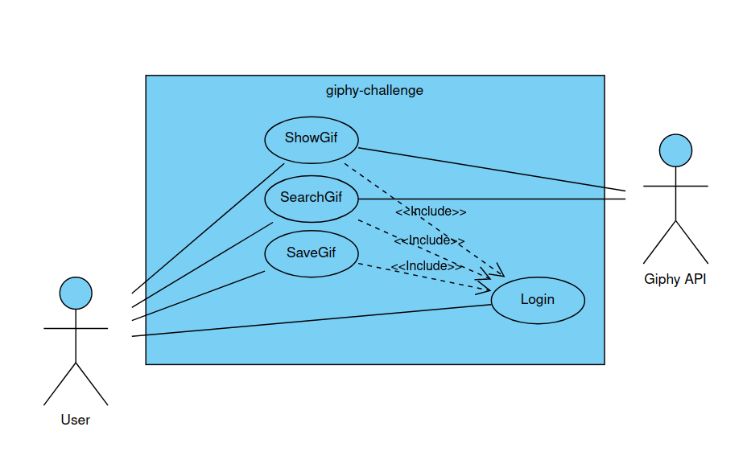
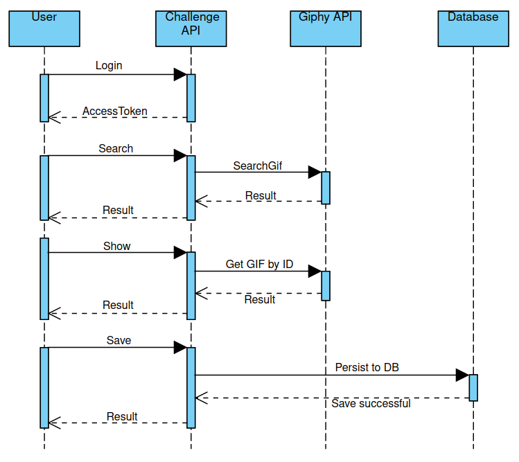
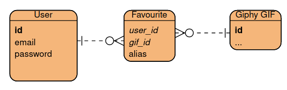

## Deployment for testing

### Pre-requisites
- Docker
- Git

### Instructions
```
# Clone git repo
git clone https://github.com/fstramucci/giphy-challenge/

# Change directory
cd giphy-challenge

# Install the required PHP dependencies
docker run --rm \
    -u "$(id -u):$(id -g)" \
    -v "$(pwd):/var/www/html" \
    -w /var/www/html \
    laravelsail/php83-composer:latest \
    composer install --ignore-platform-reqs

# Create the .env file
cp .env.example .env
# Note: now edit .env to add your API key to the GIPHY_KEY variable

# Deploy Laravel Sail (Laravel's docker wrapper)
./vendor/bin/sail up -d

# Generate app keys
./vendor/bin/sail artisan key:generate

# Create the .env.testing file
cp .env .env.testing

# Run migrations
./vendor/bin/sail artisan migrate --seed

# Install Passport
./vendor/bin/sail artisan passport:install

# Run tests
./vendor/bin/sail artisan test --env=testing

```
**Note:** running tests will refresh the database. If you want to use the seeded user, you need to re-seed the database with:
```
./vendor/bin/sail artisan db:seed
./vendor/bin/sail artisan passport:install
```

## Diagrams

### Use cases diagram


### Sequence Diagram


### Entity Relationships Diagram
